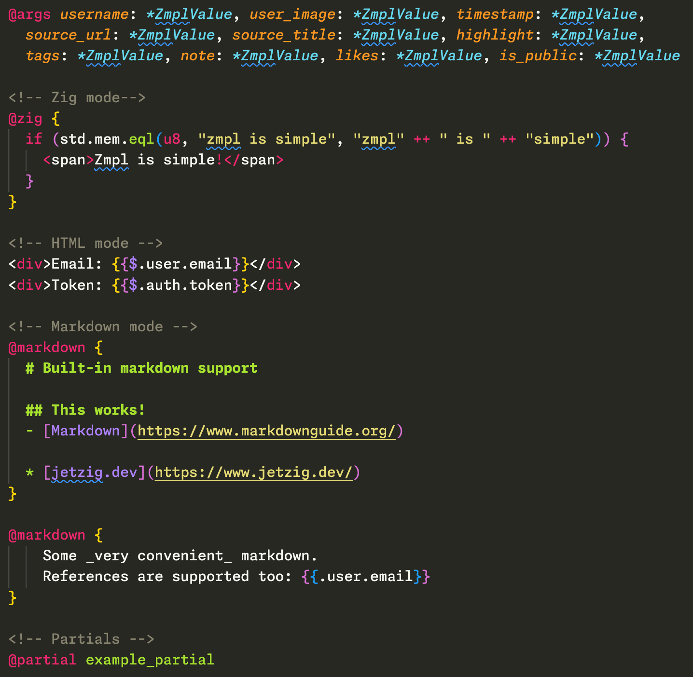

# Zmpl grammar extension

[Zmpl](https://github.com/jetzig-framework/zmpl) is a templating language for Zig.

Learn more about Zmpl at the [documentation](https://www.jetzig.dev/documentation/sections/zmpl/introduction).

## Features

This is a Visual Studio Code extension that provides syntax highlighting for Zmpl files.

Sample in Monokai theme:

## Credits

* [https://github.com/z1fire/zmpl-syntax-highlighting-vscode](Zackary Housen's VS Code extensions)

## License

MIT License. Copyright (c) 2025 [U-Zyn Chua](https://uzyn.com).
